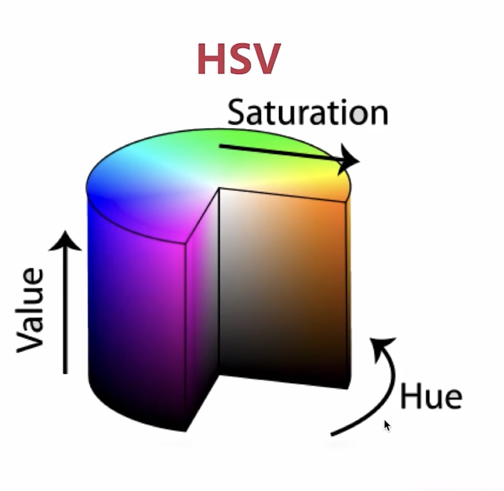
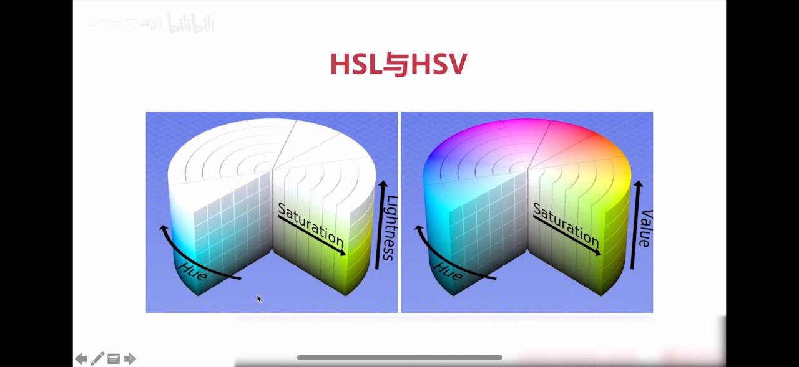

# This is my OpenCV
## BASIC of BASIC
### 窗口和图片
+ `namedWindows("name" WINDOW_NORMAL/WINDOW_AUTOSIZE)`
+ `imshow("image name")`
+ `resizeWindow("name" ,width,height)`
+ `waitKey(0)`
+ `destroyAllWindows()`
+ `imread(path, flag)`: `flag`默认`IMAGE_COLOR`: 加载图片
+ `imwrite(name , img)`: 保存图片 
### 视频
+ `VideoCapture()`
+ `read()`
+ `release()`
+ `VideoWriter(filename, int fourcc, double fps, Size frameSize, bool isColor = true)`: 输出文件/多媒体文件格式/帧率/分辨率
+ `write()`
### 鼠标
+ `setMouseCallback(windowname, callback, userdata)`
+ `callback(event, x, y, flags, userdata)`: 鼠标操作/鼠标坐标x,y/鼠标键及组合键/
### TrackBar
+ `createTrackbar(Trackbar_name , windows_name, value, maxnum, callback, uerdata)`
+ `getTrackbarPos()`
## 色差空间及基础操作(RGB/HSV/YUV)
+ RGB: 
+ HSV: Hue(色相/色彩)/Saturation(饱和度)/Value(明度)

+ HSL: Hue/Saturation/Ligthness

+ YUV: 视频
## 基本图形绘制
## 图像的运算
## 图形的进阶操作
## 滤波
## 形态学操作
## 轮廓
## 特征检测
### 

